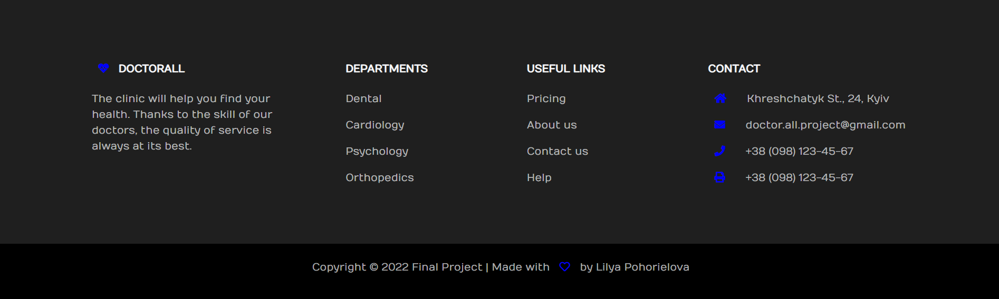

# Clinic DoctorAll
### Final project on course Java NIX 9
Appointment management system using Hospital as an example. Web application include such user roles:
*  Admin
*  Doctor
*  Patient

### Main functionality:

* Admin create/update/delete doctors and patients. Find all doctors by departments.
* Doctor create/update/delete slots and add patients. Find all patients and all slots by doctor.
* Patient create/update/delete appointments, add doctor, get vaccinated. Find all doctors and all appointments by patient.
* Vaccination supplier module provides availability of vaccines. 

### Main Technologies used:

*  Spring Boot
*  View: Thymeleaf (HTML), CSS, Bootstrap, JS
*  Database management system: MySQL 
*  2 Modules: Main, Supplier

### Get Started:
1. Run ElasticSearch (bin/elasticsearch from https://www.elastic.co/downloads/elasticsearch)
2. Run Vaccination Supplier (data from supplier.sql)
3. Run Clinic Application (data from doc-all-data.sql)
4. Check init.mode = never and init = false in application.properties
5. Go to http://localhost:8080/open/dashboard/
6. Login/Register as doctor/patient or use login data.

### Login Data:
- Admin (email - [admin@mail.com](), password - **rootroot**)
- Patient (email - [patient@mail.com](), password - **rootroot**)
- Doctor (email - [doctor@mail.com](), password - **rootroot**)

---
# Screenshots:

# Authorization:

